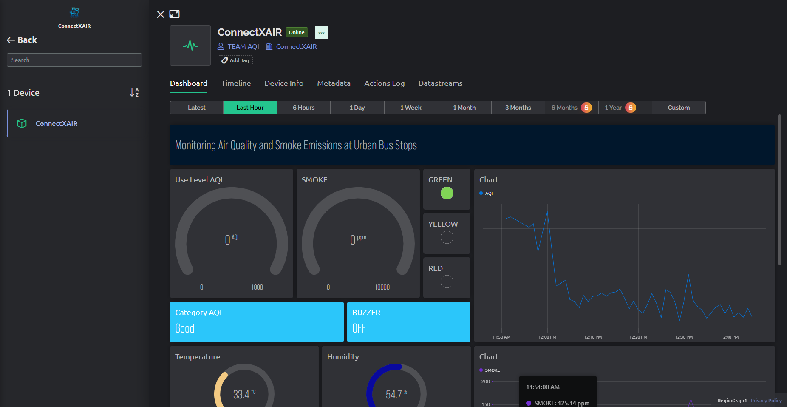

# Monitoring Air Quality and Smoke Emissions at Urban Bus Stops
_Ini adalah sebuah proyek untuk memonitoring kualitas udara di halte bus dengan menggunakan perangkat yaitu MQ135 dan juga MQ2 untuk mendeteksi ASAP_
_Sistem ini sudah integrasi dengan bylnk jadi kita bisa memantau melalui aplikasi tersebut untuk melihat data_
<h1>Anggota Proyek: </h1>
<h4>1.Hamdi Sholahudin</h4>
<h4>2.Hendri Hananta Wahyu Wibowo</h4>
<h4>3.Abu Yazid Bustomi</h4>
<h4>4.Ferry Aditya Herman </h4>
<h4>5.Tu Bagus Dwi Fikri </h4>

## ScreenShoot Proyek :
<h3>Dashboard Blynk</h3>

<h3>Mobile Blynk</h3>

<h3>Device Monitoring</h3>

  

  

## Fitur :
- Mendeteksi Emisi ASAP
- Mendeteksi Kualitas Udara
- Mendeteksi Temperatur dan juga Kelembapan
- Ada Respon Suara jika ada asap berlebih atau kebakaran
- Ada led indikator untuk melihat kualitas udara (Green, Yellow, Red)
- Mendeteksi Lokasi Prangkat

## Requirements Prangkat :
- MQ2
- MQ135
- DHT22
- ESP32
- Buzzer
- LED RGB
- GPS NEON 6

## Platform Yang digunakan:
- Blynk
- Arduino IDE
- Platform.io
  
## Contact :
-[GitHub](https://www.github.com/Fekka1st/)
- 

